# **Apache**

[Marinela Mihaylova](https://github.com/Intkai/apache)

## **Resumen**

Documentación acerca del servidor de apache. Instalación, configuración y ejemplo de uso.

## **Palabras Clave**

- _Servidor Apache_
- _HTTP_
- _Web_
- _Dirección IP_

## **Índice**

- [Introducción](#introducción)
- [Instalación de Apache](#instalación)
  - [Otros comandos de utilidad](#Otros)
- [Configuración de Apache](#configuración)
  - [Ejemplo de uso](#Ejemplo)
- [Bibliografía](#bibliografía)

## **Introducción**

[Apache](https://dinahosting.com/ayuda/que-es-apache-y-para-que-sirve/) es un servidor web gratuito [HTTP](https://es.wikipedia.org/wiki/Protocolo_de_transferencia_de_hipertexto) de código abierto para plataformas Unix. Actualmente es el servidor web más usado en todo el mundo debido a sus seguridad y estabilidad que está desarrollado y mantenido por una comunidad de usuarios en torno a la [Apache Software Foundation](https://httpd.apache.org/docs/2.4/es/).

## **Instalación de Apache**

Para la correcta instalación de Apache en primer lugar deberemos abrir la terminal y actualizar el índice de paquetes locales para que reflejen los últimos cambios anteriores con el comando _$ sudo apt update_
A continuación, instalamos el paquete _Apache2_

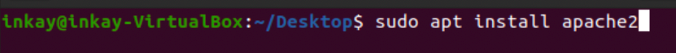

Una vez instalado, modificaremos los ajustes de firewall para permitir el acceso externo a los puertos web predeterminados. Enumeraremos los perfiles de aplicacion _ufw_ .

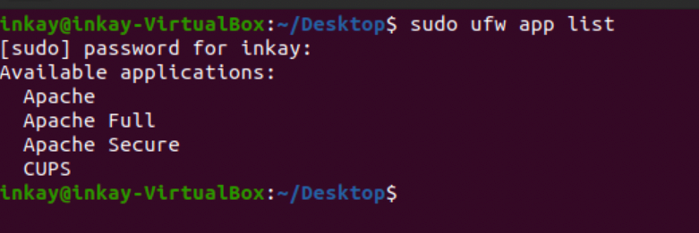

De la lista que hemos obtenido, querremos habilitar **Apache**

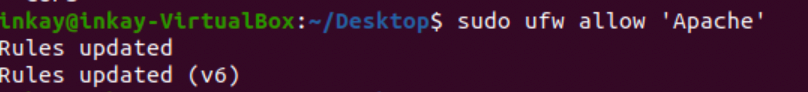

Por último, realizaremos una verificacion del sistema para saber si se encuentra iniciado y habilitado.

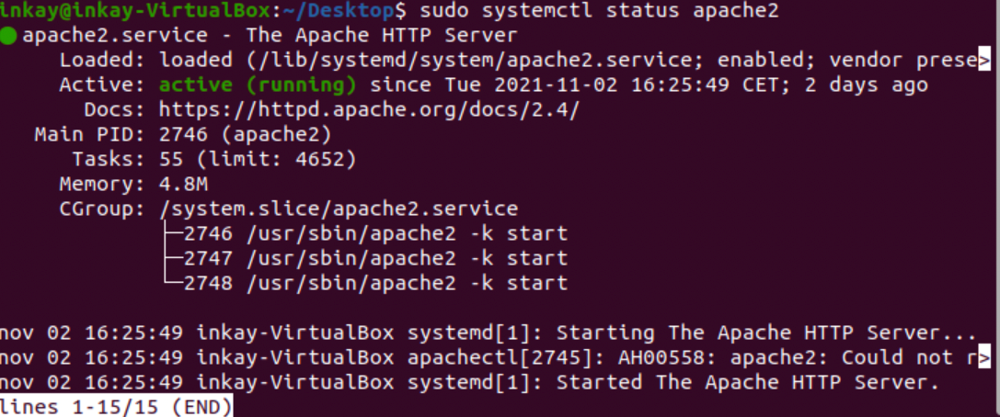

A pesar de que aquí podemos observar que todo funciona bien aparentmente, la mejor manera de comprobar que todo está en perfecto funcionamiento es solicitar una página de apache. Puede acceder a la página de destino predeterminada de Apache para confirmar que el software funcione correctamente mediante su dirección IP: Si no conoce la **_dirección IP_** de su servidor, puede obtenerla con el siguiente comando.

Introducimos la **_dirección IP_** en nuestro navegador y si todo funciona correctamente, este nos debe llevar a la siguiente página web.

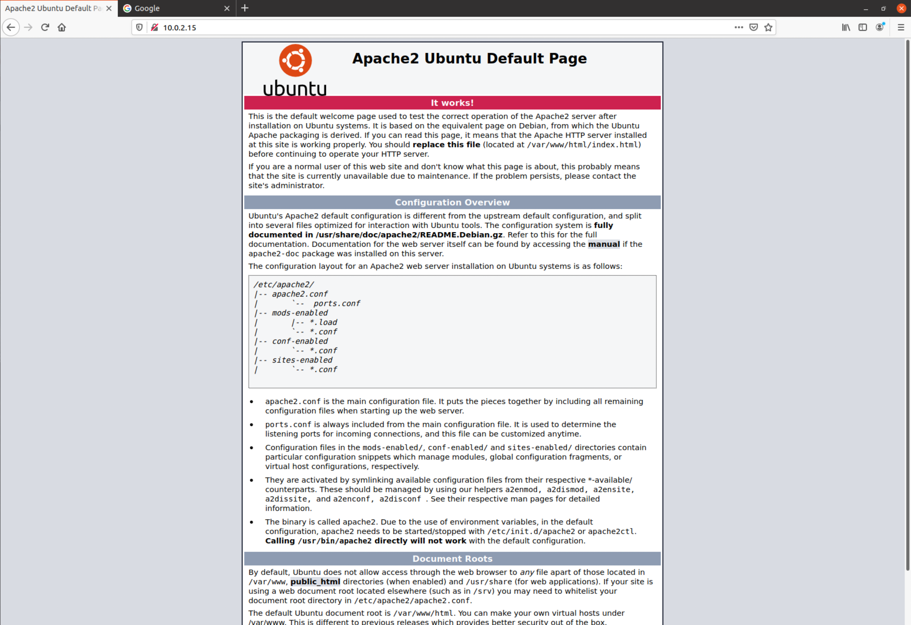

Con todo esto tendremos la instalación finalizda y testeada correctamente. Procederemos a introducir el siguiente comando para parar el sevidor.

### **Otros comandos de utilidad**

Para iniciar el servidor web cuando no esté activo, escribimos lo siguiente: _sudo systemctl start apache2_

Para detener y luego iniciar el servicio de nuevo, escribimos lo siguiente: _sudo systemctl restart apache2_

Si solo realizamos cambios de configuración, Apache a menudo puede recargarse sin cerrar conexiones. Para hacerlo, utilizamos este comando: _$sudo systemctl reload apache2_

Por defecto, Apache está configurado para iniciarse automáticamente cuando el servidor lo hace. Si no es lo que queremos, deshabilitamos este comportamiento escribiendo lo siguiente: _$sudo systemctl disable apache2_

Para volver a habilitar el servicio de modo que se cargue en el inicio, escriba lo siguiente: _$sudo systemctl enable apache2_

Usaremos el siguiente comando para probar la configuración de Apache en busca de cualquier sintaxis o error del sistema: _$sudo apachectl -t_

Con el siguiente comando podemos verificar nuestra versión de Apache: _$sudo apache2 -v_

## **Configuración de Apache**

El apartado de configuración se realizará con un ejemplo. Empezaremos por crear una carpeta para la nueva web que vamos a crear.

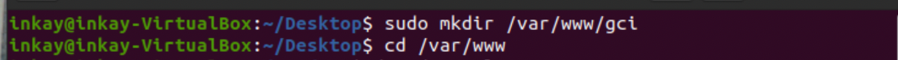

Una vez creada la carpeta, creamos dentro un index.html que rellenamos con cualquier código. En este caso utilizamos el código de ejemplo que nos ha sido subministrado.

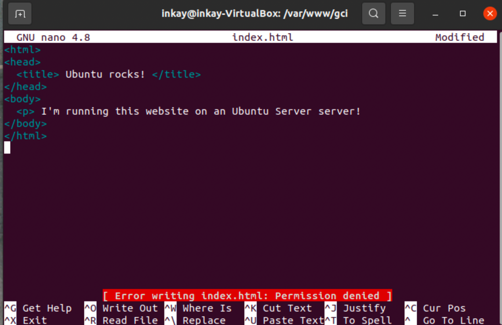

Como podemos observar aquí, aparece un error de permisos denegados al intentar guardar el index.html
Al hacer un _ls-lisa_ observamos que los permisos del directorio son de root. Esto se debe a que al crear la carpeta princiapl en la que estamos trabajando la hemos creado como sudo, entonces para poder editar el index.html debemos abririlo como superusuario de la misma manera.

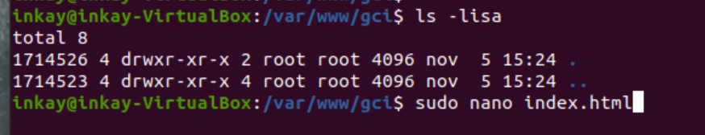

Una vez hayamos guardado, nos dirigimos al directorio **_/sites-available/_**, situado en **_/etc/apache2/_**

Ya dentro del directorio, introducimos el siguiente comando que nos sirve para realizar una copia del **_.conf_** a uno nuevo que modificaremos para realizar esta práctica.

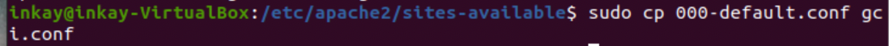

Cuando lo hayamos copiado, hacemos un **_nano_** del archivo para poder verlo y poder realizar todos los cambios que haya que hacer.

Cambiamos el _DocumentRoot_ a la ruta donde se encuentra nuestro archivo, y en _ServerName_ especifico qué hay que escribir en el navegador para visualizar el fichero.

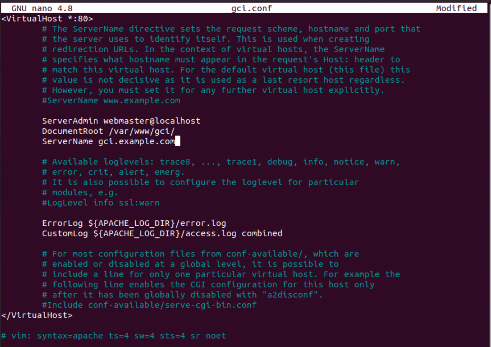

A continuación, activamos el archivo para poder verlo en el navegador con el siguiente comando.

Después de activarlo, tendremos que realizar el siguiente comando para reiniciar el servidor y asegurarnos de que funciona bien. En este caso no hemos podido reinciarlo debido a que no estaba inicializado apache. Debemos incializar y posteriormente volver a escribir el comando.

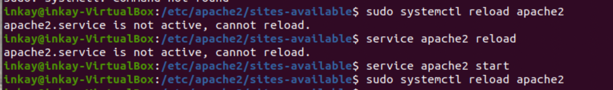

ÇPosteriormente. ntramos en la carpeta **_/etc/_** y modificamos el archivo **_hosts_** donde asociaremos nuestra **_loopback_** al **_ServerName_** que declaramos en el fichero anterior.

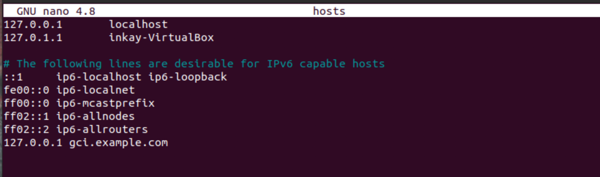

Por último escribiremos el **_ServerName_** en nuestro navegador y confirmamos que va funciona correctamente en caso de poder visualizarla.

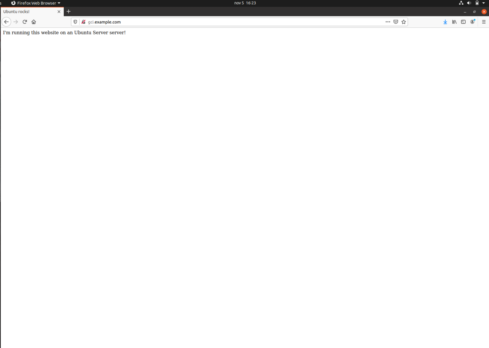

## **Bibliografía**

[Origen Apache](https://es.wikipedia.org/wiki/Servidor_HTTP_Apache)

[Más información acerca de Apache](https://www.hostinger.es/tutoriales/que-es-apache/)

[Comandos Apache](https://es.joecomp.com/apache-commands-you-should-know)

[Instalar el servidor web Apache en Ubuntu 20.04](https://www.digitalocean.com/community/tutorials/how-to-install-the-apache-web-server-on-ubuntu-20-04-es)
